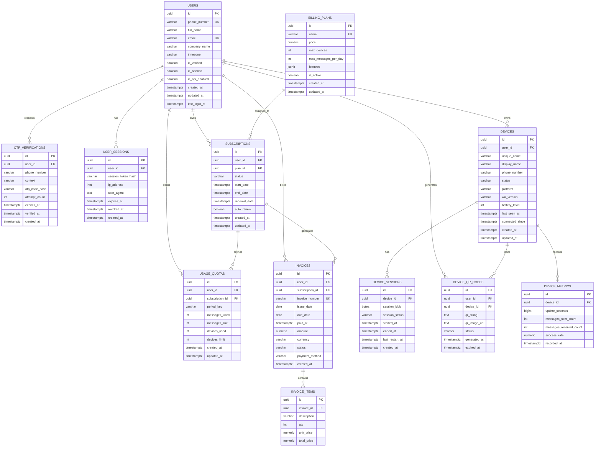
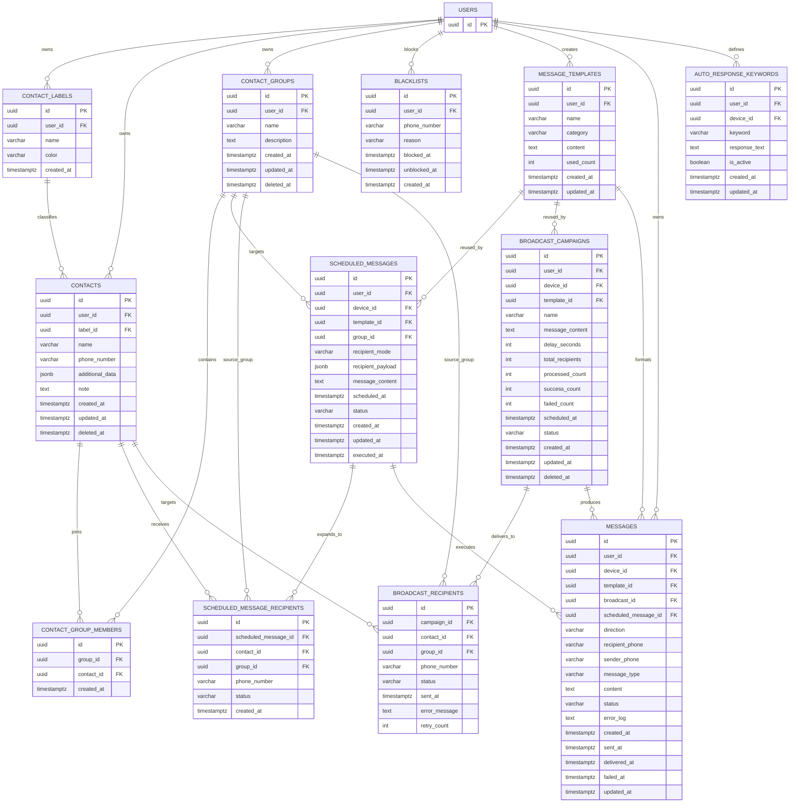

# WACAST Target ERD

ERD ini diturunkan dari review di `DB_DESIGN_REVIEW_AND_TARGET_SCHEMA.md` dan disusun agar tetap terbaca. Diagram dibagi per domain supaya tidak terlalu padat.

## 1. Identity, Billing, and Devices

## 2. Contacts and Messaging

## 3. Integrations, Monitoring, and App Support

```mermaid
erDiagram
    USERS {
        uuid id PK
    }

    DEVICES {
        uuid id PK
        uuid user_id FK
    }

    WEBHOOKS {
        uuid id PK
        uuid user_id FK
        uuid device_id FK
        varchar webhook_url
        varchar secret_key_hash
        boolean is_active
        timestamptz created_at
        timestamptz updated_at
    }

    WEBHOOK_EVENT_SUBSCRIPTIONS {
        uuid id PK
        uuid webhook_id FK
        varchar event_key
        boolean is_enabled
    }

    WEBHOOK_DELIVERIES {
        uuid id PK
        uuid webhook_id FK
        varchar event_key
        jsonb payload
        int attempt
        int http_status
        text response_body
        varchar status
        timestamptz sent_at
        timestamptz created_at
    }

    API_KEYS {
        uuid id PK
        uuid user_id FK
        varchar name
        varchar key_prefix
        varchar key_hash
        timestamptz last_used_at
        timestamptz expires_at
        boolean is_active
        timestamptz created_at
        timestamptz revoked_at
    }

    API_LOGS {
        uuid id PK
        uuid user_id FK
        uuid device_id FK
        varchar endpoint
        jsonb req_body
        jsonb response_body
        inet ip_address
        timestamptz created_at
    }

    DAILY_MESSAGE_STATS {
        uuid id PK
        uuid user_id FK
        uuid device_id FK
        date stat_date
        int sent_count
        int failed_count
        int delivered_count
        numeric success_rate
        timestamptz created_at
    }

    FAILURE_RECORDS {
        uuid id PK
        uuid user_id FK
        uuid device_id FK
        uuid message_id FK
        varchar recipient_phone
        varchar failure_type
        text failure_reason
        timestamptz occurred_at
        timestamptz created_at
    }

    SERVICE_HEALTH_CHECKS {
        uuid id PK
        varchar service_name
        varchar status
        int latency_ms
        numeric uptime_percent
        timestamptz last_incident_at
        timestamptz checked_at
    }

    RESOURCE_USAGE_METRICS {
        uuid id PK
        varchar metric_name
        numeric metric_value
        varchar metric_unit
        timestamptz recorded_at
    }

    ONBOARDING_PROGRESS {
        uuid id PK
        uuid user_id FK
        varchar step_key
        boolean is_completed
        timestamptz completed_at
        timestamptz created_at
        timestamptz updated_at
    }

    NOTIFICATION_SETTINGS {
        uuid id PK
        uuid user_id FK
        varchar event_key
        boolean email_enabled
        boolean in_app_enabled
        timestamptz created_at
        timestamptz updated_at
    }

    NOTIFICATIONS {
        uuid id PK
        uuid user_id FK
        varchar type
        varchar title
        text body
        boolean is_read
        timestamptz read_at
        timestamptz created_at
    }

    AUDIT_LOGS {
        uuid id PK
        uuid user_id FK
        varchar action_type
        varchar resource_type
        uuid resource_id
        jsonb metadata
        inet ip_address
        text user_agent
        timestamptz created_at
    }

    WARMING_POOL {
        uuid id PK
        uuid device_id FK
        int intensity
        int daily_limit
        int message_send_today
        boolean is_active
        timestamptz next_action_at
    }

    WARMING_SESSIONS {
        uuid id PK
        uuid device_id FK
        varchar target_phone
        text message_sent
        text response_received
        varchar status
    }

    USERS ||--o{ WEBHOOKS : owns
    DEVICES ||--o{ WEBHOOKS : scoped_to
    WEBHOOKS ||--o{ WEBHOOK_EVENT_SUBSCRIPTIONS : subscribes
    WEBHOOKS ||--o{ WEBHOOK_DELIVERIES : logs
    USERS ||--o{ API_KEYS : owns
    USERS ||--o{ API_LOGS : produces
    DEVICES ||--o{ API_LOGS : scoped_to
    USERS ||--o{ DAILY_MESSAGE_STATS : aggregates
    DEVICES ||--o{ DAILY_MESSAGE_STATS : measures
    USERS ||--o{ FAILURE_RECORDS : experiences
    DEVICES ||--o{ FAILURE_RECORDS : causes
    USERS ||--o{ ONBOARDING_PROGRESS : tracks
    USERS ||--o{ NOTIFICATION_SETTINGS : configures
    USERS ||--o{ NOTIFICATIONS : receives
    USERS ||--o{ AUDIT_LOGS : triggers
    DEVICES ||--o{ WARMING_POOL : has
    DEVICES ||--o{ WARMING_SESSIONS : runs
```

## 4. Notes

- `SERVICE_HEALTH_CHECKS` dan `RESOURCE_USAGE_METRICS` bersifat optional karena fitur System Health saat ini sudah tidak tampil di navigasi dashboard.
- `WARMING_POOL` dan `WARMING_SESSIONS` dipertahankan di ERD karena sudah ada di schema existing backend, walau belum terefleksi penuh di UI dashboard.
- `SCHEDULED_MESSAGE_RECIPIENTS` sengaja dipisah agar scheduled message tidak bergantung penuh pada JSON dan tetap queryable saat data membesar.
- `BROADCAST_MESSAGES` tidak dimasukkan ke ERD inti. Kalau satu campaign memang hanya satu payload, lebih baik field payload digabung ke `broadcast_campaigns`. Kalau nanti butuh multi-step payload, tabel itu bisa dihidupkan lagi sebagai `broadcast_contents`.
